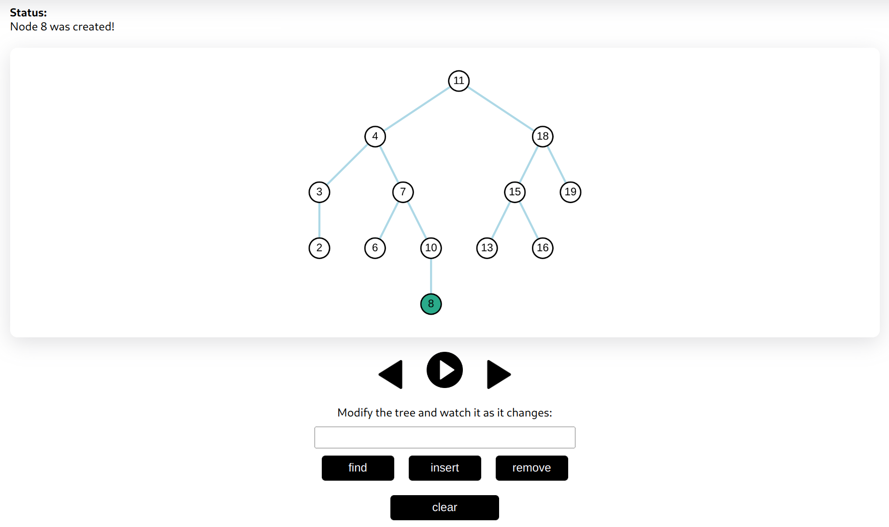

# Alorithm Visualizer 



This project is aimed at creating react web application for visualizing algorithms, namely topological sorting, and insert/update/delete operations for AVL-tree. 

## Brief implementation summary

The application is divided into frontend and backend. Backend server, written in [flask](https://flask.palletsprojects.com/en/2.2.x/), handles all the heavy lifting -  it performs operations on graphs and trees and saves these into a state list. Then, when the operation is fully finished, it sends the list of states to the client.

The client then receives these actions and hadles them sequentially. Applying animations is handled by the asynchronous event loop. As the list of states is received on the client side, it is enqueued to the history queue - a queue that remembers some number of dequeued items. The asynchronous event loop is then notified about the new data in the queue and starts handling it. Because the queue used is a history queue, some number of visualiztion steps (default is 100) can also be reverted, i.e. you can pause the visualization, or rewind it.

AVL-Tree used in this project is the modified version of the [tree from lab 1 on the subject "algorithms"](https://github.com/MykolaKovalyk/Year2Term1AlgoLabs/tree/lab1/lab1/avl_tree).

Grafics part of the frontend of the application is implemented using [cytoscape.js](https://js.cytoscape.org/).

## How to run

### Create environment

Run command line in the project folder, and from there, run:

- `python -m venv env `
- `source env/bin/activate` (on POSIX)
- `Scripts/activate.bat` (on Windows)
- `pip install -r requirements.txt`

### Run server

Run:

- `python server/main.py`

### Run client

Go to `algo-vis/` and run:

- `npm start`

The project is now started and the browser window should open. You're all set!
If the browser did not open, check [http://localhost:3000](http://localhost:3000). 

## Conventions

Variables, functions and class methods are named by `cammelCase` convention, classes and react functional components are named by `PascalCase`, and constants are all in `MACRO_CASE`. Each react component has destructured mandatory parameters. Effort is made to make components not too big - react component, if too large, is divided into several subcomponents. JSX tags are kept short - if attribute list for a tag is too long, it is broken apart into several lines, lambdas in cllback attribute parameters line `onClick` are not used.

Parent -> child interaction is provided by using props callback pattern: every child that exposes it's functionality to the parent has `getInterface` attribute. The child calls this method providing a param `interfaceObj`, representing an object with exposed child's functionality. Parent can provide callback to `getInterface` attribute, and assign `interfaceObj` to its own ref or state variables. This way to handle parent -> child interaction is a persistent pattern throughout the project.

General layout of the react component file in the project looks like this:

```JavaScript
import SomeComponent from "./some/local/File"
import someConfigMethod from "some-module"
import { useRef, useState, useSomeHook, SomeOtherComponent } from "react"
import useStateRef from "react-usestateref"


const SOME_CONSTANT =  "this is a constant"

someConfigMethod()


export default function MainComponent({ mandatoryParam1, mandatoryParam2, ...props }) {
     const someRef = useRef("default value")
    const someOtherRef = useRef(false)

    const [someVar, setSomeVar] = useState("default value")
    const [someOtherVar, setSomeOtherVar, someOtherVarRef] = useStateRef()


    useEffect(() => {
        /* code here */
    }, [mandatoryParam1])


    /* config code */


    return <some_tag> 
        /* jsx code here */
    </some_tag>


    function innerFunction(...params) {
        /* some code */
    }
}


function SubComponent({ mandatoryParam1, mandatoryParam2, ...props }) {
    /* ... */
}

function OtherSubComponent({ mandatoryParam1, mandatoryParam2, ...props }) {
    /* ... */
}


function SomeBigImportantFunction(...params) {
    /* ... */
}

```
